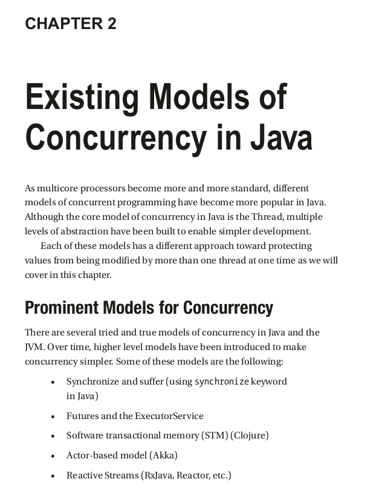

## Reactive Streams

Reactive Streams provide an abstraction for highly concurrent,
asynchronous applications with support for backpressure.
While they can be used along with any of the preceding models
of concurrency, they attempt to provide enough functionality to be
fully sufficient for any implementation (over and above the other
models of concurrency). However, since they run in a multithreaded
way, you must ensure thread safety in your code if you modify
shared state. Try to avoid using other methods (e.g., using a
LockingTransaction or synchronize block) and instead stay within
the Reactive Streams model. Reactive Streams use the concepts of
publisher and subscriber, along with various strategies for backpressure
to model concurrency. We will cover these concepts.
- A publisher emits events at some rate.
- A subscriber observes those events on possibly a
different thread and does something with them.
- Some frameworks use other words (such as Source
and Sink) to mean the same thing as publisher and
subscriber.

As we will see, many Reactive Streams frameworks allow
interoperation with other existing models of concurrency, such as futures,
to allow a smooth transition between the two.

